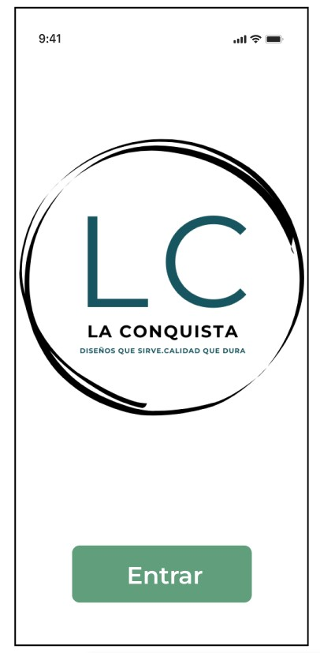
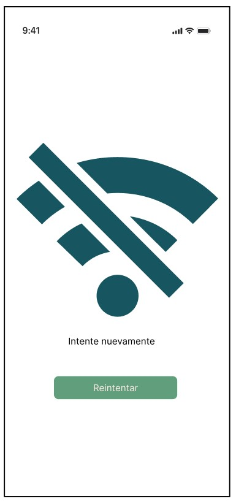
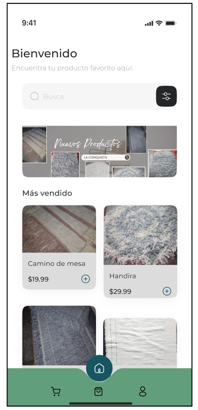
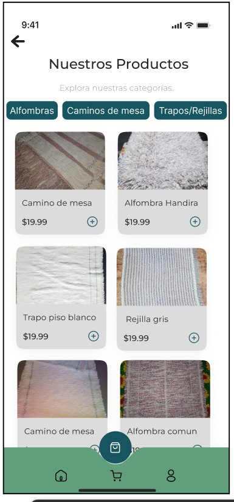
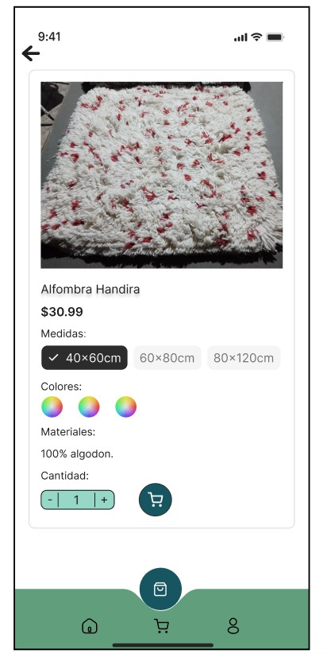
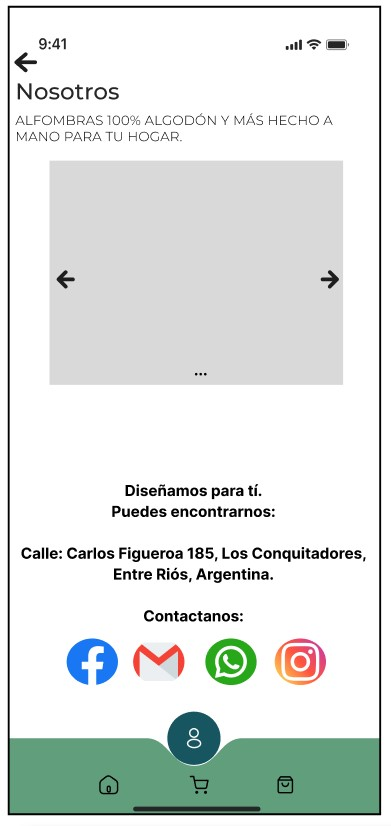
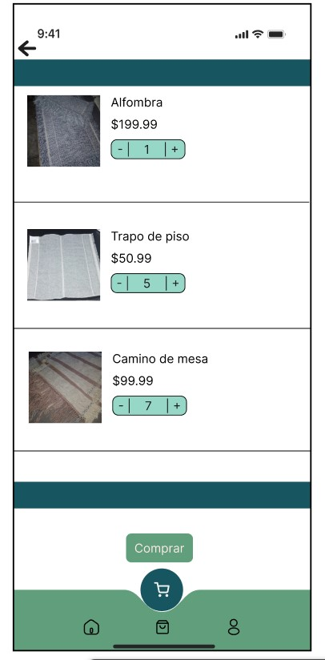
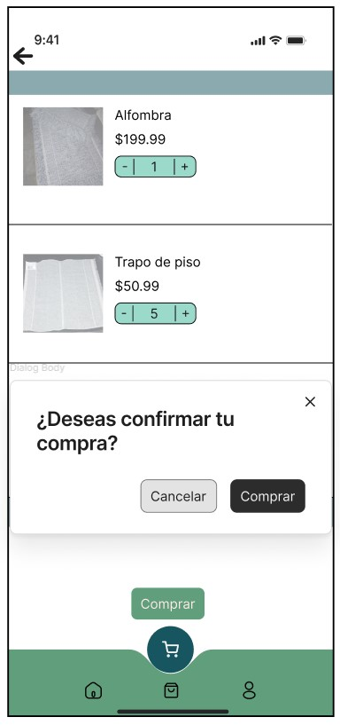

La Conquista - Tienda de Productos Artesanales
La Conquista es una app web para vender productos textiles artesanales como alfombras, trapos de piso, caminos de mesa y rejillas. Se enfoca en una experiencia visual atractiva y fácil de usar.

🛍️ Servicios
Catálogo con imágenes, descripciones y precios

Compras online con métodos de pago seguros

Pedidos personalizados

Soporte al cliente (chat o formulario)

👤 Público
Hogares y decoradores que buscan calidad artesanal

Comercios que necesitan textiles funcionales y lindos

Personas que prefieren productos sustentables y locales

🌐 Referencias

Nanimarquina (https://nanimarquina.com/es-int?srsltid=AfmBOorC-e2s4Fmdan3maLGgWYzziyrdXruUZ2H_8BcZSdmjxtAEKHb4&country=AR)

Mihran (https://www.mihranalfombras.com.ar/?srsltid=AfmBOooHCmWAr6nEuHOE8jM3KCB-juZKcIFslatHGKK8KxbHmc6wAmKt)

Lorena Canals (https://lorenacanals.com/es?srsltid=AfmBOoq1HJCgU-a4n7Gxsiu5fq7jbWGXFw-8d_-R0SvW9tlNGIDkNjJl)

🎨 Estilo
Colores:

Azul profundo #175560

Verde suave #609e7c

Turquesa vibrante #39b496

Tipografía:

Montserrat o Poppins (sans-serif, moderna y legible)

🖌️ Bocetos de la App

Aquí puedes ver los primeros bocetos creados para visualizar la estructura y diseño de la app:

---

**Pantalla principal**: vista general del catálogo de productos por categoría.

---

**Pantalla de producto**: detalles, precio, imágenes y botón de compra personalizada.

---

**Sección "Nosotros"**: historia de la marca y valores artesanales.

---

**Carrito de compras**: visualización de productos agregados, cantidades y botón de pago.

---

⚙️ Instalación del Proyecto

📋 Requisitos previos

Asegúrate de tener instalado:

Node.js (recomendado: v18 o superior)

Expo CLI

Instalar con:

npm install -g expo-cli

Git

Un emulador o dispositivo físico con Expo Go

🚀 Pasos para ejecutar la app

Clona este repositorio:

git clone https://github.com/tu-usuario/laconquistaapp.git

cd laconquistaapp

Instala las dependencias:

npm install

Inicia la app:

npm start

📦 Tecnologías y dependencias

React Native + Expo

Navegación:

@react-navigation/native

@react-navigation/native-stack

@react-navigation/bottom-tabs

UI y experiencia:

@expo/vector-icons

react-native-reanimated

react-native-gesture-handler

Mapa:

react-native-maps

Carousel:

react-native-reanimated-carousel

